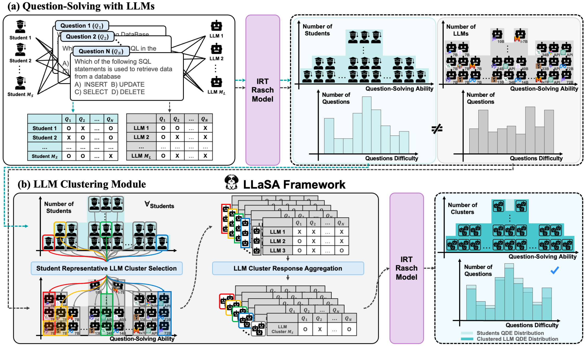

# 👩‍🏫 LLMs are Students at Various Levels
This repository contains the official implementation of "[**Large Language Models are Students at Various Levels: Zero-shot Question Difficulty Estimation**](https://openreview.net/pdf?id=whRJT6j4EM)".


> Jae-Woo Park<sup>1\*</sup>, Seong-Jin Park<sup>1\*</sup>, Hyun-Sik Won<sup>1</sup>, Kang-Min Kim<sup>1†</sup>  
<sup>1 </sup>The Catholic University of Korea  
<sup>\* </sup>These authors contributed equally to this work. <sup>† </sup>Corresponding Author  

This repository includes:
- **LLaSA Setup**.
- **Question-Solving using Various LLMs**.
- **Question Difficulty Estimation using LLaSA and Zero-shot LLaSA**.

---

## Table of Contents
1. [Project Structure](#project-structure)
2. [LLaSA Setup](#llasa-setup)
   1. [Installation](#installation)
   2. [Dataset Preparation](#dataset)
   3. [Step-by-Step Process](#step-1-organizing-the-dataset-structure)
3. [Question-Solving using Various LLMs](#question-solving-using-various-llms)
   1. [LLM Question-Solving Records](#step-1-get-various-llms-question-solving-records)
   2. [Result Analysis](#step-2-analyze-and-integrate-results)
4. [Question Difficulty Estimation (QDE)](#qde-using-llasa-and-zero-shot-llasa)
   1. [LLaSA without LLMDA](#llasa-without-llmda)
   2. [LLaSA with LLMDA](#llasa-with-llmda)
   3. [Zero-shot LLaSA](#zero-shot-llasa)
   4. [Report Results](#report-result)
5. [Citation](#citation)

---

## Project Structure
```plaintext
├── config  # Configurations, API keys, and constants.
│   ├── __init__.py
│   ├── constants.py
│   └── api_keys.py
├── data  # Contains user-provided raw data and generated processed data.
│   ├── processed  # [Will be generated] Processed files.
│   │   ├── dk_test_ability.csv
│   │   ├── dk_test_difficulty.csv
│   │   ├── dk_test_question.json
│   │   ├── dk_train_ability.csv
│   │   ├── dk_train_difficulty.csv
│   │   ├── dk_train_question.json
│   │   └── dk_whole_question.json
│   └── raw  # [User-provided] Raw data provided by the user.
│       ├── test_question.json
│       ├── test_transaction.csv
│       ├── train_question.json
│       └── train_transaction.csv
├── logs  # [Will be generated] Log files and experiment results.
│   ├── llasa  # LLaSA result logs.
│   │   └── …
│   └── question_solving  # Question-solving result logs.
│       ├── …
│       ├── model_answer_log.csv
│       └── total_results.csv
├── data_setting  # Scripts for data processing.
│   └── …
├── llasa  # LLaSA and Zero-shot LLaSA Frameworks.
│   └── …
├── question_solving  # Scripts for question-solving using LLMs.
│   └── …
└── shells  # Shell scripts for running modules.
    └── …
```

---

## LLaSA Setup

### Installation
To install the R library for Item Response Theory (IRT) on Ubuntu, run:
```bash
sudo apt-get update
sudo apt-get install r-base
Rscript requirements.r
cd llms-are-students-of-various-levels
```
> After installation, type `R` in the terminal to start the R environment.

Set up your Python environment:
```bash
pip install torch
pip install -r requirements.txt
```
> Ensure that you download the [appropriate version of PyTorch](https://pytorch.org/) for your system.

Configure `config/constants.py` and set your API keys in `config/api_keys.py`.

### Dataset
We conducted Question Difficulty Estimation (QDE) using the following two datasets. Any dataset containing questions, answers, and students' question-solving records can be used for this task:
- [DBE-KT22](https://dataverse.ada.edu.au/dataset.xhtml?persistentId=doi:10.26193/6DZWOH)
- [ASSISTMents 2005-2006](https://pslcdatashop.web.cmu.edu/Files?datasetId=120)
> You need a large transaction dataset to use LLaSA effectively because IRT cannot be measured if each question has only a single response record or if a single model has only one response record.

#### Step 1: Organizing the Dataset Structure
Make sure your dataset follows this structure:
```
├─ data
│   ├─ raw
│   │   ├─ train_transaction.csv
│   │   ├─ train_question.json
│   │   ├─ test_transaction.csv
│   │   └─ test_question.json
```

<details>
<summary>Dataset Structure Details</summary>

Here is an example of `train_transaction.csv` and `train_question.json`. Please prepare `test_transaction.csv` and `test_question.json` in the same format.

> **train_transaction.csv**:

| question_id | S1 | S2 | ... | SN |
|-------------|----|----|-----|----|
| Q1          | 1  | 1  | ... | 1  |
| Q2          | 0  | 1  | ... | 1  |

> **train_question.json**:
```json
{
  "question_text": "Choose the correct ...",
  "question_id": 1,
  "choices": ["10", "20", "30", "40"],
  "answer": ["10"]
}
```
</details>

#### Step 2: Estimating Difficulty and Ability using IRT
Run the following command to estimate student abilities and question difficulties:
```bash
sh shells/data_setting/run_irt_setting.sh
```

#### Step 3: Adding Hints (Optional)
Generate hints using the GPT API:
```bash
sh shells/data_setting/run_hint_setting.sh
```

#### Step 4: Merging Datasets
Merge the train and test sets for question-solving:
```bash
sh shells/data_setting/run_merge_setting.sh
```

---

## Question-Solving using Various LLMs
This question-solving process involves LLMs directly solving problems to extract question-solving records. It was developed with reference to the code from [Leveraging Large Language Models for Multiple Choice Question Answering](https://github.com/BYU-PCCL/leveraging-llms-for-mcqa).

### Step 1: Get Various LLMs Question-Solving Records
Run these scripts to get question-solving records from different LLMs:
```bash
sh shells/question_solving/run_local_models.sh
sh shells/question_solving/run_anthropic_models.sh
sh shells/question_solving/run_gpt_models.sh
```

### Step 2: Analyze and Integrate Results
Analyze the results and integrate them into a unified dataset:
```bash
sh shells/question_solving/run_analyze.sh
sh shells/question_solving/run_integrate.sh
```

---

## QDE using LLaSA and Zero-shot LLaSA

### LLaSA without LLMDA
Run LLaSA without LLMDA:
```bash
sh shells/llasa/run_llasa_without_llmda.sh
```

### LLaSA with LLMDA
Run LLaSA with LLMDA:
```bash
sh shells/llasa/run_llasa_with_llmda.sh
```

### Zero-shot LLaSA
Run Zero-shot LLaSA using intuitive input for student levels:
```bash
sh shells/llasa/run_zeroshot_llasa.sh
```

### Report Result
Check results of LLaSA and Zero-shot LLaSA:
```bash
sh shells/llasa/run_report_1.sh  # LLaSA without LLMDA
sh shells/llasa/run_report_2.sh  # LLaSA with LLMDA
sh shells/llasa/run_report_3.sh  # Zero-shot LLaSA
```

---

## Citation
```bibtex
@inproceedings{
anonymous2024large,
title={Large Language Models are Students at Various Levels: Zero-shot Question Difficulty Estimation},
author={Anonymous},
booktitle={Submitted to ACL Rolling Review - June 2024},
year={2024},
url={https://openreview.net/forum?id=whRJT6j4EM},
note={under review}
}
```
