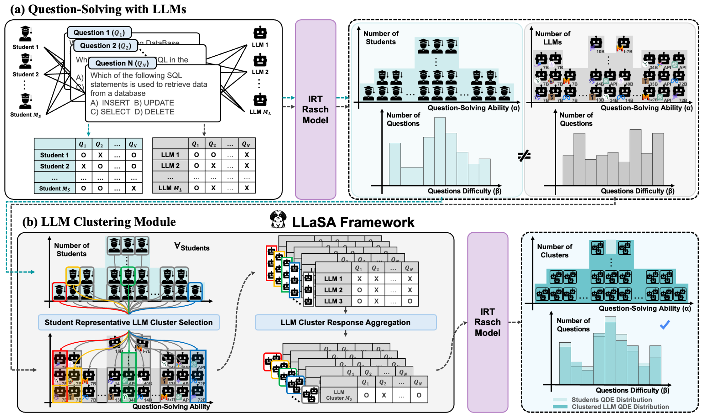

# 👩‍🏫 LLMs are Students at Various Levels
This repository contains the official implementation of "[**Large Language Models are Students at Various Levels: Zero-shot Question Difficulty Estimation**](https://aclanthology.org/2024.findings-emnlp.477/)".


> Jae-Woo Park<sup>1,2\*</sup>, Seong-Jin Park<sup>1,3\*</sup>, Hyun-Sik Won<sup>1</sup>, Kang-Min Kim<sup>1,4†</sup>  
<sup>1 </sup>Department of Artificial Intelligence  
<sup>2 </sup>School of Information, Communications, and Electronic Engineering  
<sup>3 </sup>Department of Mathematics  
<sup>4 </sup>Department of Data Science  
The Catholic University of Korea, Bucheon, Republic of Korea  
<sup>\* </sup>These authors contributed equally to this work. <sup>† </sup>Corresponding Author  


This repository includes:
- **LLaSA Setup**.
- **Question-Solving using Various LLMs**.
- **Question Difficulty Estimation using LLaSA and Zero-shot LLaSA**.

---

## Table of Contents
1. [Project Structure](#project-structure)
2. [LLaSA Setup](#llasa-setup)
   1. [Installation](#installation)
   2. [Dataset Preparation](#dataset)
   3. [Step-by-Step Process](#step-1-organizing-the-dataset-structure)
3. [Question-Solving using Various LLMs](#question-solving-using-various-llms)
   1. [LLM Question-Solving Records](#step-1-get-various-llms-question-solving-records)
   2. [Result Analysis](#step-2-analyze-and-integrate-results)
4. [Question Difficulty Estimation (QDE)](#qde-using-llasa-and-zero-shot-llasa)
   1. [LLaSA without LLMDA](#llasa-without-llmda)
   2. [LLaSA with LLMDA](#llasa-with-llmda)
   3. [Zero-shot LLaSA](#zero-shot-llasa)
   4. [Report Results](#report-result)
5. [Citation](#citation)

---

## Project Structure
```plaintext
├── config  # Configurations, API keys, and constants.
│   ├── __init__.py
│   ├── constants.py
│   └── api_keys.py
├── data  # Contains user-provided raw data and generated processed data.
│   ├── processed  # [Will be generated] Processed files.
│   │   ├── dk_test_ability.csv
│   │   ├── dk_test_difficulty.csv
│   │   ├── dk_test_question.json
│   │   ├── dk_train_ability.csv
│   │   ├── dk_train_difficulty.csv
│   │   ├── dk_train_question.json
│   │   └── dk_whole_question.json
│   └── raw  # [User-provided] Raw data provided by the user.
│       ├── test_question.json
│       ├── test_transaction.csv
│       ├── train_question.json
│       └── train_transaction.csv
├── logs  # [Will be generated] Log files and experiment results.
│   ├── llasa  # LLaSA result logs.
│   │   └── …
│   └── question_solving  # Question-solving result logs.
│       ├── …
│       ├── model_answer_log.csv
│       └── total_results.csv
├── data_setting  # Scripts for data processing.
│   └── …
├── llasa  # LLaSA and Zero-shot LLaSA Frameworks.
│   └── …
├── question_solving  # Scripts for question-solving using LLMs.
│   └── …
└── shells  # Shell scripts for running modules.
    └── …
```

---

## LLaSA Setup

### Installation
To install the R library for Item Response Theory (IRT) on Ubuntu, run:
```bash
sudo apt-get update
sudo apt-get install r-base
Rscript requirements.r
cd llms-are-students-of-various-levels
```
> After installation, type `R` in the terminal to start the R environment.

Set up your Python environment:
```bash
pip install torch
pip install -r requirements.txt
```
> Ensure that you download the [appropriate version of PyTorch](https://pytorch.org/) for your system.

Configure `config/constants.py` and set your API keys in `config/api_keys.py`.

### Dataset
We conducted Question Difficulty Estimation (QDE) using the following two datasets. Any dataset containing questions, answers, and students' question-solving records can be used for this task:
- [DBE-KT22](https://dataverse.ada.edu.au/dataset.xhtml?persistentId=doi:10.26193/6DZWOH)
- [ASSISTMents 2005-2006](https://pslcdatashop.web.cmu.edu/Files?datasetId=120)
> You need a large transaction dataset to use LLaSA effectively because IRT cannot be measured if each question has only a single response record or if a single model has only one response record.

#### Step 1: Organizing the Dataset Structure
Make sure your dataset follows this structure:
```
├─ data
│   ├─ raw
│   │   ├─ train_transaction.csv
│   │   ├─ train_question.json
│   │   ├─ test_transaction.csv
│   │   └─ test_question.json
```

<details>
<summary>Dataset Structure Details</summary>

Here is an example of `train_transaction.csv` and `train_question.json`. Please prepare `test_transaction.csv` and `test_question.json` in the same format.

> **train_transaction.csv**:

| question_id | S1 | S2 | ... | SN |
|-------------|----|----|-----|----|
| Q1          | 1  | 1  | ... | 1  |
| Q2          | 0  | 1  | ... | 1  |

> **train_question.json**:
```json
{
  "question_text": "Choose the correct ...",
  "question_id": 1,
  "choices": ["10", "20", "30", "40"],
  "answer": ["10"]
}
```
</details>

#### Step 2: Estimating Difficulty and Ability using IRT
Run the following command to estimate student abilities and question difficulties:
```bash
sh shells/data_setting/run_irt_setting.sh
```

#### Step 3: Adding Hints (Optional)
Generate hints using the GPT API:
```bash
sh shells/data_setting/run_hint_setting.sh
```

#### Step 4: Merging Datasets
Merge the train and test sets for question-solving:
```bash
sh shells/data_setting/run_merge_setting.sh
```

---

## Question-Solving using Various LLMs
This question-solving process involves LLMs directly solving problems to extract question-solving records. It was developed with reference to the code from [Leveraging Large Language Models for Multiple Choice Question Answering](https://github.com/BYU-PCCL/leveraging-llms-for-mcqa).

### Step 1: Get Various LLMs Question-Solving Records
Run these scripts to get question-solving records from different LLMs:
```bash
sh shells/question_solving/run_local_models.sh
sh shells/question_solving/run_anthropic_models.sh
sh shells/question_solving/run_gpt_models.sh
```

### Step 2: Analyze and Integrate Results
Analyze the results and integrate them into a unified dataset:
```bash
sh shells/question_solving/run_analyze.sh
sh shells/question_solving/run_integrate.sh
```

---

## QDE using LLaSA and Zero-shot LLaSA

### LLaSA without LLMDA
Run LLaSA without LLMDA:
```bash
sh shells/llasa/run_llasa_without_llmda.sh
```

### LLaSA with LLMDA
Run LLaSA with LLMDA:
```bash
sh shells/llasa/run_llasa_with_llmda.sh
```

### Zero-shot LLaSA
Run Zero-shot LLaSA using intuitive input for student levels:
```bash
sh shells/llasa/run_zeroshot_llasa.sh
```

### Report Result
Check results of LLaSA and Zero-shot LLaSA:
```bash
sh shells/llasa/run_report_1.sh  # LLaSA without LLMDA
sh shells/llasa/run_report_2.sh  # LLaSA with LLMDA
sh shells/llasa/run_report_3.sh  # Zero-shot LLaSA
```

---

## Citation
```bibtex
@inproceedings{park-etal-2024-large,
    title = "Large Language Models are Students at Various Levels: Zero-shot Question Difficulty Estimation",
    author = "Park, Jae-Woo  and
      Park, Seong-Jin  and
      Won, Hyun-Sik  and
      Kim, Kang-Min",
    editor = "Al-Onaizan, Yaser  and
      Bansal, Mohit  and
      Chen, Yun-Nung",
    booktitle = "Findings of the Association for Computational Linguistics: EMNLP 2024",
    month = nov,
    year = "2024",
    address = "Miami, Florida, USA",
    publisher = "Association for Computational Linguistics",
    url = "https://aclanthology.org/2024.findings-emnlp.477",
    pages = "8157--8177",
    abstract = "Recent advancements in educational platforms have emphasized the importance of personalized education. Accurately estimating question difficulty based on the ability of the student group is essential for personalized question recommendations. Several studies have focused on predicting question difficulty using student question-solving records or textual information about the questions. However, these approaches require a large amount of student question-solving records and fail to account for the subjective difficulties perceived by different student groups. To address these limitations, we propose the LLaSA framework that utilizes large language models to represent students at various levels. Our proposed method, LLaSA and the zero-shot LLaSA, can estimate question difficulty both with and without students{'} question-solving records. In evaluations on the DBE-KT22 and ASSISTMents 2005{--}2006 benchmarks, the zero-shot LLaSA demonstrated a performance comparable to those of strong baseline models even without any training. When evaluated using the classification method, LLaSA outperformed the baseline models, achieving state-of-the-art performance. In addition, the zero-shot LLaSA showed a high correlation with the regressed IRT curve when compared to question difficulty derived from students{'} question-solving records, highlighting its potential for real-world applications.",
}
```
